# Cookiecutter Github SAM API

Este proyecto es una plantilla que permite generar un proyecto "serverless" básico, que sirva como punto inicial a proyectos pequeños de un solo repositorio.

> Si requieres crear un proyecto más complejo: multiples repositorios, más de 3 desarrolladores o la plantilla ya tiene demasidadas lambdas contacta al equipo de CI/CD.

**Diagrama:**

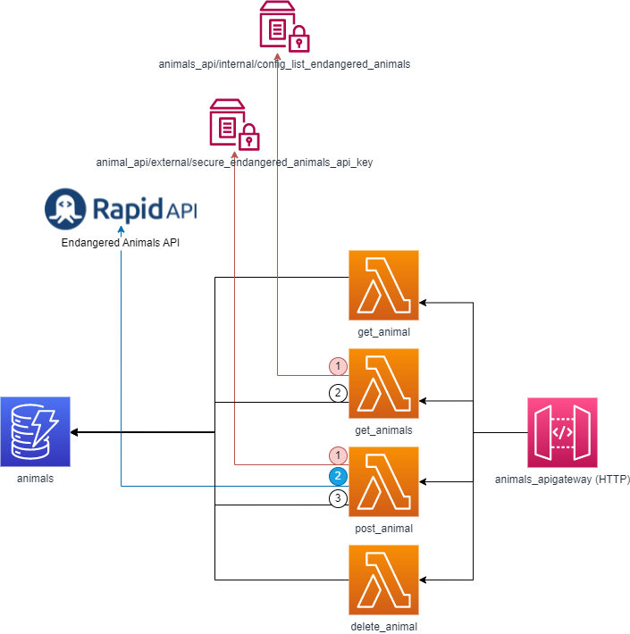

**Tipo:** API

**Descripción:** 
Esta API le permite a un zoológico llevar el control de sus animales.
- Permite obtener información sobre un animal
- Permite listar todos los animales que tienen
- Permite configurar el número de animales que devuelve por pagina si no se especifica en la petición.
- Permite agregar un nuevo animal y valida con un servicio externo si es una especie amenazada
- Permite borrar un animal

Si quieres pulir tus habilidades en AWS [puedes contribuir agregando más funcionalidades](#contribuciones).

**[Recuperación de desastres](https://aws.amazon.com/blogs/architecture/disaster-recovery-dr-architecture-on-aws-part-iii-pilot-light-and-warm-standby/)**:
- Categoría: Activo/Pasivo (Active/pasive)
- Estrategia: Espera caliente (Warm standby) 

**Lenguaje:** [Python 3.9](https://www.python.org/downloads/release/python-3913/)

**Dependencias:**
- [AWS Lambda Powertools 1.28](https://awslabs.github.io/aws-lambda-powertools-python/1.28.0/)

**Servicios:**
- [AWS API Gateway (HTTP)](https://docs.aws.amazon.com/apigateway/latest/developerguide/http-api.html)
- [AWS Lambda](https://docs.aws.amazon.com/es_es/lambda/latest/dg/welcome.html)
- [AWS DynamoDB](https://docs.aws.amazon.com/dynamodb/?icmpid=docs_homepage_featuredsvcs)
- [AWS Parameter Store](https://docs.aws.amazon.com/systems-manager/latest/userguide/systems-manager-parameter-store.html)
- [AWS CloudFormation](https://docs.aws.amazon.com/AWSCloudFormation/latest/UserGuide/Welcome.html)

**Herramientas:**
- [Cookiecutter 2.1.1](https://cookiecutter.readthedocs.io/en/2.1.1/)
- [AWS SAM ](https://docs.aws.amazon.com/serverless-application-model/latest/developerguide/serverless-sam-cli-install.html)
- [Git](https://git-scm.com/book/en/v2/Getting-Started-Installing-Git)

**Crear proyecto:** [Cookiecutter](#cookiecutter)

------------------------------------------------------------------------------------------------------------

## Índice
1. [AWS y Serverless](#aws-y-serverless)
  - [CloudFormation](#cloudformation)
  - [SAM](#sam)
2. [Github y Github Actions](#github-y-github-actions)
3. [Cookiecutter y Cruft](#cookiecutter-y-cruft)
4. [Contribuciones](#contribuciones)


## AWS y Serverless
AWS tiene varios servicios administrados que se cobran por uso, los más comunes: colas de mensajes, bus de eventos, administración de APIs, orquestación de servicios y envío de notificaciones. No es necesario instalar un producto en un servidor y mantenerlo actualizado, AWS se encarga de estas tareas y así nos concentramos en elegir la mejor herramienta para nuestro caso de uso.

También permite ejecutar código sin necesidad de un servidor dedicado: al recibir un evento que cumple ciertas condiciones AWS crea una instancia que ejecuta nuestro código, según la demanda puede crear más instancias. El cobro es por el tiempo que duró la ejecución del código y el número de instancias creadas. 

Se pueden diseñar soluciones completas utilizando estas herramientas y a este tipo de aplicaciones se les conoce como "serverless" (sin servidor). 

https://aws.amazon.com/serverless/

## CloudFormation
Es posible habilitar y configurar todos estos servicios de distintas maneras:
- [Consola web](https://console.aws.amazon.com)
- [CLI](https://aws.amazon.com/cli/)
- [APIs](https://docs.aws.amazon.com/)
- [SDKs](https://aws.amazon.com/developer/tools/)

Todas son útiles en distintos escenarios pero AWS ha creado otro servicio que permite tener estas definiciones en archivos de texto (YAML o JSON) que pueden ser agregados a un repositorio de código como este y utilizarlo para crear y modificar recursos en AWS. De esta manera se puede tener una trazabilidad sobre los cambios que se han realizado en un sistema, colaborar y realizar modificaciones modificando esta definición (infraestructura como código).

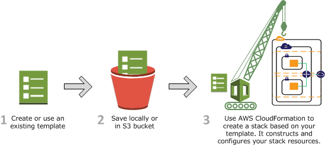
_¿Cómo funciona CloudFormation?: https://docs.aws.amazon.com/AWSCloudFormation/latest/UserGuide/cfn-whatis-howdoesitwork.html_


### SAM

#### SAM template specification 

Las plantillas de CloudFormation pueden crecer rápidamente y definir todos los recursos de una aplicación puede ser una tarea repetitiva y tardada, para solucionar esto AWS ha creado un framework que permite definir la mayoría de recursos de una aplicación "serverless" de una forma simple y con menos líneas. 

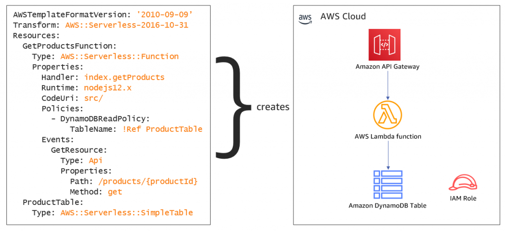
_Especificación de plantilas SAM: https://docs.aws.amazon.com/serverless-application-model/latest/developerguide/sam-specification.html_

Estas definiciones cortas soportan la mayoría de servicios utilizados en una aplicación "serverless" como:

-   [AWS::Serverless::Api](https://docs.aws.amazon.com/serverless-application-model/latest/developerguide/sam-resource-api.html)
Crea una función lambda que recibe peticiones a traves del API Gateway, permite agregar un documento de OpenAPI para la configuración del API REST. [Comparación entre API REST y HTTP API](https://docs.aws.amazon.com/apigateway/latest/developerguide/http-api-vs-rest.html)

-   [AWS::Serverless::Function](https://docs.aws.amazon.com/serverless-application-model/latest/developerguide/sam-resource-function.html)
Crea una función lambda y un rol de IAM asociado a ella. La función puede ser iniciada por distintos eventos (S3 | SNS | Kinesis | DynamoDB | SQS | Api | Schedule | CloudWatchEvent | EventBridgeRule | CloudWatchLogs | IoTRule | AlexaSkill)

-   [AWS::Serverless::HttpApi](https://docs.aws.amazon.com/serverless-application-model/latest/developerguide/sam-resource-httpapi.html)
Crea una función lambda que recibe peticiones a traves del API Gateway. [Comparación entre API REST y HTTP API](https://docs.aws.amazon.com/apigateway/latest/developerguide/http-api-vs-rest.html)

-   [AWS::Serverless::LayerVersion](https://docs.aws.amazon.com/serverless-application-model/latest/developerguide/sam-resource-layerversion.html)
Si multiples funciones requieren las mismas librerías es posible crear una capa reutilizables que incluya estas librerías.

-   [AWS::Serverless::SimpleTable](https://docs.aws.amazon.com/serverless-application-model/latest/developerguide/sam-resource-simpletable.html)
Permite crear tablas de DynamoDB.

-   [AWS::Serverless::StateMachine](https://docs.aws.amazon.com/serverless-application-model/latest/developerguide/sam-resource-statemachine.html)
SAM también tiene soporte para agregar a tu proyecto Step Functions y orquestar distintas lambdas o incluso otros servicios de AWS.

#### SAM command line interface


SAM también ofrece un CLI que permite inicializar proyectos basados en plantillas, construir y desplegar una plantilla de SAM, crear eventos de pruebas, ejecutar localmente el proyecto y obtener logs los componentes luego de desplegados en AWS.

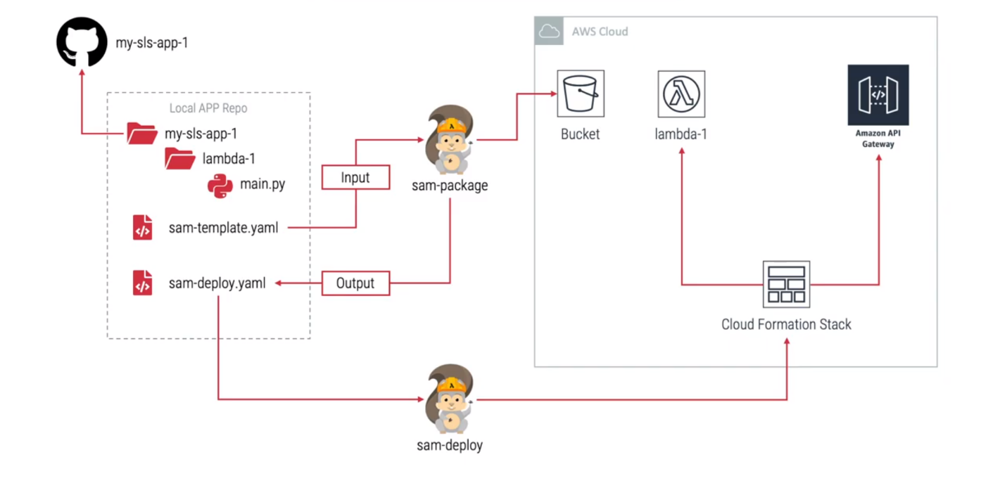
_Inciando con el CLI de SAM_: https://www.sqlshack.com/getting-started-with-the-aws-sam-cli/

- Inicializar proyecto de SAM:

```bash
sam init
```

- Construir aplicación:

Usando Docker (No requiere que tengas Python instalado)

```bash
sam build --use-container
```

Usando Docker y una imagen en especifico (No requiere que tengas Python instalado)

```bash
sam build --use-container --build-image public.ecr.aws/sam/build-python3.8:1.32.0
```

- Generar un evento de ejemplo:

Si necesitas ver un ejemplo de la estructura del evento que recibe tu lambda puede utilizar estos comandos.

- Para SQS
  
  ```bash
  sam local generate-event sqs receive-message
  ```

- API Gateway:

```bash
sam local generate-event apigateway aws-proxy --method GET --path document --body "{"test": "1", "tests2": "2"}"
```

Para visualizar la lista de servicios de los que se pueden generar eventos favor de visitar: [sam local generate-event - AWS Serverless Application Model](https://docs.aws.amazon.com/serverless-application-model/latest/developerguide/sam-cli-command-reference-sam-local-generate-event.html)

- Desplegar API en ambiente local (localhost:3000):

```bash
sam local start-api
```

- Invocar lambda local:

Si necesitas validar el funcionamiento de tu lambda puede pasarle un evento en formato json si necesidad de desplegar. (Requiere Docker instalado)

```bash
sam local invoke -e events/event.json
```

Para mayor información de comandos de CLI de SAM: [AWS SAM CLI command reference - AWS Serverless Application Model](https://docs.aws.amazon.com/serverless-application-model/latest/developerguide/serverless-sam-cli-command-reference.html)


### Cursos

Si quieres aprender a crear aplicaciones con herramientas "serverless" de AWS puedes tomar alguno de estos cursos (en negritas están los recomendados):
- [**Coursera: Building Modern Python Applications on AWS**](https://www.coursera.org/learn/building-modern-python-applications-on-aws?specialization=aws-python-serverless-development)
  - Este curso da una introducción a los servicios más usados al construir aplicaciones serverless (Lambda, API Gateway, DynamoDB, Cognito y S3), a las herramientas que estaras utilizando en el día a día (AWS CLI, Boto3 Cloud Shell y Postman) y a utilizar una metodología orientada a APIs (API Driven Development). Es el curso que se recomienda tomar antes de iniciar tu primer proyecto. El curso se puede tomar de forma gratuita, pero para realizar las prácticas, cuestionarios y obtener un certificado de completado se debe realizar un pago.
  - Existen versiones del curso para otros lenguajes: [Building Modern Java Applications on AWS](https://www.coursera.org/learn/building-modern-java-applications-on-aws?specialization=aws-java-serverless-development) y [Building Modern Node.js Applications on AWS](https://www.coursera.org/learn/building-modern-node-applications-on-aws?specialization=aws-nodejs-serverless-development)
- [**AWS Workshop: Building Serverless Apps with SAM**](https://catalog.us-east-1.prod.workshops.aws/workshops/d21ec850-bab5-4276-af98-a91664f8b161)
  - Es una introducción rápida al framework de SAM, si tienes prisa con este workshop aprenderas lo  minimo necesaro para construir aplicaciones con SAM.
- [Serverless land: Learn](https://serverlessland.com/learn)
  - Serverless land es un sitio creado y mantenido por el equipo de AWS, en la sección de _learn_ hay algunos cursos si se quiere profundizar más en el uso de estas herramientas.
- [Coursera: AWS Fundamentals Building Serverless Applications](https://www.coursera.org/learn/aws-fundamentals-building-serverless-applications#syllabus)
  - Construye un chatbot utilizando herramientas serverless. El curso se puede tomar de forma gratuita, pero para realizar las prácticas, cuestionarios y obtener un certificado de completado se debe realizar un pago.

### AWS IDE Toolkits

AWS ofrece extensiones para distintos IDEs, los relevantes para este repositorio son:
- [Visual Studio Code](https://aws.amazon.com/visualstudiocode/)
- [PyCharm](https://aws.amazon.com/pycharm/)

Utilizar alguna de estas extensiones en tu IDE favorito te facilitará el desarrollo de aplicaciones SAM.

### Referencias

Estas referencias pueden ser útiles cuando estás desarrollando una aplicación con SAM:

- [Lista de recursos que agrega SAM a CLoudFormation (Más simples describir)](https://docs.aws.amazon.com/serverless-application-model/latest/developerguide/sam-specification-resources-and-properties.html)
- [Lista de recursos en CloudFormation](https://docs.aws.amazon.com/AWSCloudFormation/latest/UserGuide/aws-template-resource-type-ref.html)
- [Lista de política incluidas en SAM](https://docs.aws.amazon.com/serverless-application-model/latest/developerguide/serverless-policy-templates.html)
- [Patrónes comunes al usar SAM y herramientas "serverless"](https://serverlessland.com/patterns?framework=SAM)
- [Ejemplos de máquinas de estados (Step Functions)](https://serverlessland.com/workflows)
- [Fragmentos de código y consultas comunes](https://serverlessland.com/snippets)


## Github y Github Actions

Github inicio como una plataforma para subir repositorios de código basados en Git, con el tiempo ha ido agregando más funcionalidades al punto de volverse una plataforma para administrar todo el ciclo de vida de una aplicación:
- Control de versiones (Github Repositories)
- Colaboración (Pull request y Forks)
- Marcar liberaciones (Releases)
- Repositorio de artefactos (Github Packages)
- Administración de proyectos (Github Proyects)
- Automatización de la construcción y despliegue (Github Actions)
- Automatización de tareas dentro de Github (Github Actions)
- Escaneo de vulnerabilidas
- Estadisticas de uso

### Ramas (Explicación de trunk based development)

Todo repositorio de código debe tener definidas algunas reglas para trabajar y colaborar. Trunk base development es la estrategia que mejor nos ha funcionado pues reduce la cantidad de conflicto al reducir la cantidad de "merges" o "pull requests":


_Trunk based development:_ https://trunkbaseddevelopment.com/

#### main

La rama _main_ es la rama principal (trunk en el diagrama) todo el código se sube directamente ahí, si se agrego un nuevo desarrollador que aún no está familiarizado con el código se puede solicitar que introduzca sus cambios mediante "pull request" para que sean revisados por su mentor o guía en el proyecto, eventualmente podrá introducir cambios directamente en _main_.

#### releases/x.x.x

Una vez que se libera el código a producción se genera una rama de release, estas ramas están protegidas (ya no se pueden modificar) y deben utilizar [versionado semántico](https://semver.org/lang/es/) para indicar la versión.

_Ejemplo: releases/1.0.0_

#### fix/x.x.x

> Recuerda que las ramas releases/x.x.x están protegidas.

En caso de que ocurra un bug en producción, hay dos posibles caminos:

1. Si en main no se han introducido nuevos cambios al código, el fix se deberá realizar directamente en main y al generar un nuevo release se incrementará la versión parche.
  - _Ejemplo: 1.0.0 -> 1.0.1_
2. Si el código en main ya cambio porque se está trabajando en una nueva funcionalidad, este código aún no está listo para enviarse a producción así que no podemos realizar el fix sobre main. En estos casos se crea una rama fix con la versión de parche incrementada a partir de la rama release que queremos corregir. Una vez arreglado el código se despliega en producción y se crea una nueva rama releases.
  - _Ejemplo: releases/1.0.0 -> fix/releases/1.0.1 -> releases/1.0.1_


### Github Workflows (Como los workflows en el repo permiten seguir la estrategia de ramas y desplegar con algunos clics)

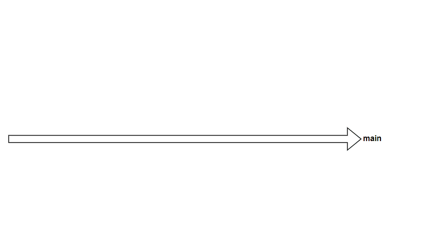

Workflow reusables (Como los workflows hacen llamados a los workflows reusables para completar tareas y liga a la administración de workflows)

Agregar nota: Si el proyecto crece y se crean multiples repositorios, se debe crear un repo independiente en el que puedan guardarse los workflows reusables y otras utilerías

### Referencias

## Cookiecutter y Cruft

Crea un proyecto (Crear proyecto a partir de plantilla de cookiecutter y agregar las credenciales como secretos en Github)
## Prerequisitos:
Contar con las siguientes herramientas instaladas:
   - [Python](https://www.python.org/downloads/release/python-3913/)
   - [Cookiecutter](https://cookiecutter.readthedocs.io/en/stable/installation.html)
   - [Git](https://git-scm.com/downloads)
   - 
## Overview:

```mermaid
  graph TD;


      AWS-->1_IAM;
      1_IAM-->crear_usuario;
      1_IAM-->copiar_account_id;
      crear_usuario-->marcar_acceso_programatico;
      marcar_acceso_programatico-->agregar_politicas_requeridas;
      agregar_politicas_requeridas-->agregar_tags_del_proyecto;
      agregar_tags_del_proyecto-->copiar_access_key;
      agregar_tags_del_proyecto-->copiar_secret_key;
      copiar_account_id-->agregar_account_id;

      AWS-->2_KMS;
      2_KMS-->crear_llave_simetrica_multiregion_SSM;
      crear_llave_simetrica_multiregion_SSM-->copiar_ARN;
      2_KMS-->crear_llave_simetrica_multiregion_DynamoDB;
      crear_llave_simetrica_multiregion_DynamoDB-->copiar_ARN;
      crear_llave_simetrica_multiregion_SSM-->configurar_regionalidad_en_region_dr;
      crear_llave_simetrica_multiregion_DynamoDB-->configurar_regionalidad_en_region_dr;
      configurar_regionalidad_en_region_dr-->copiar_ARN;
      copiar_ARN-->ingresarlos_al_inicializar_cookiecutter;    

      3_GitHub-->crear_repositorio;
      crear_repositorio-->crear_ambientes;
      crear_ambientes-->configurar_secretos_ambiente;
      copiar_access_key-->agregar_secreto_de_access_key;
      copiar_secret_key-->agregar_secreto_de_secret_key;
      agregar_secreto_de_access_key-->configurar_secretos_ambiente;
      agregar_secreto_de_secret_key-->configurar_secretos_ambiente;
      agregar_account_id-->configurar_secretos_ambiente;
                
```
#### - Los pasos 1 y 2 deberán ser realizados en las cuentas AWS de cada ambiente (develop, prod)
## Pasos

---
[1. Configuración de llaves AWS](#configuración-de-llaves-aws) \
[2. Creación de llaves KMS](#creación-de-llaves-kms) \
[3. Creación de repositorio y ambientes](#creación-de-repositorio) \
[4. Inicialización del proyecto](#inicializar-proyecto) \
[5. Post-inicialización del proyecto](#post-inicialización-del-proyecto) \
---

## Configuración de llaves AWS
-------------------
Para poder realizar los despliegues a una cuenta AWS. Es importante generar un usuario en las cuentas
destino para que esto se pueda lograr. Es muy importante que el usuario cuente con acceso programático. 
Para mayor información visitar: https://docs.aws.amazon.com/IAM/latest/UserGuide/id_users_create.html#id_users_create_console


### Creando usuario:
#### Crear usuario con acceso programático:


#### Agregar las políticas necesarias:
En este punto es indispensable que el usuario que desplegará, cuente con acceso a Cloudformation y los servicios que estará
desplegando:


#### Agregar tag relacionado al proyecto:

#### Se salvaguardarán las credenciales generadas:
Estas serán configuradas en los secretos de GitHub, al igual que el número de cuenta de AWS.


## Creación de llaves KMS
-------------------
Como prerequisito es importante crear 2 llaves KMS simétricas "[multiregión](https://docs.aws.amazon.com/kms/latest/developerguide/multi-region-keys-overview.html)", una para SSM y otra para DynamoDB.
La región de creación de la llave será la región principal. Y la secundaría será la destinada para DR.

El nombrado debe seguir el siguiente estándar:
identificador_del_proyecto-servicio_de_aws-ambiente

Ejemplo de llave SSM:

Identificador = proyectonuevo\
Servicio = ssm\
Ambiente = dev

#### Nombre de la nueva llave a crear: proyectonuevo-ssm-dev
Ejemplo de llave DynamoDB:

Identificador = proyectonuevo\
Servicio = dynamo\
Ambiente = dev

#### Nombre de la nueva llave a crear: proyectonuevo-dynamodb-dev

NOTA: Este proceso debe realizarse en ambas cuentas (desarrollo y producción).
Cuando [inicialicemos el proyecto con cookiecutter](#inicializar-proyecto) nos solicitará los ARN's 
de las llaves llaves. Por lo que es importante tenerlas a la mano cuando se inicialice el proyecto.


## Creación de repositorio
-------------------
Se debe crear un repositorio nuevo. El repositorio debe ser creado vacío, para que se pueda inicializar correctamente el proyecto.

## Creación de ambientes
Es necesario crear 2 [ambientes](https://docs.github.com/en/github-ae@latest/actions/deployment/targeting-different-environments/using-environments-for-deployment) en el repositorio para poder inicializar el proyecto, *develop* y *production*
#### Ambiente develop:
Para ello nos dirigiremos a "Settings" > "Environments" > "New environment":


Agregaremos el ambiente "develop" y daremos clic en "Configure environment":

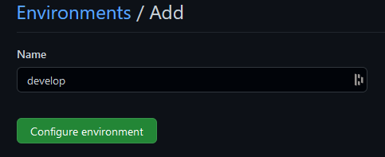

Posteriormente, daremos clic em "Save protection rules".:


#### Ambiente production:
Sería el mismo paso que seguimos en el ambiente *develop*:


Esta vez se nombrará como *production*:

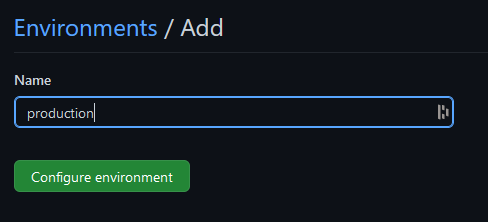

Por último, agregaremos a los equipos o personas que pueden aprobar despliegues en este ambiente:

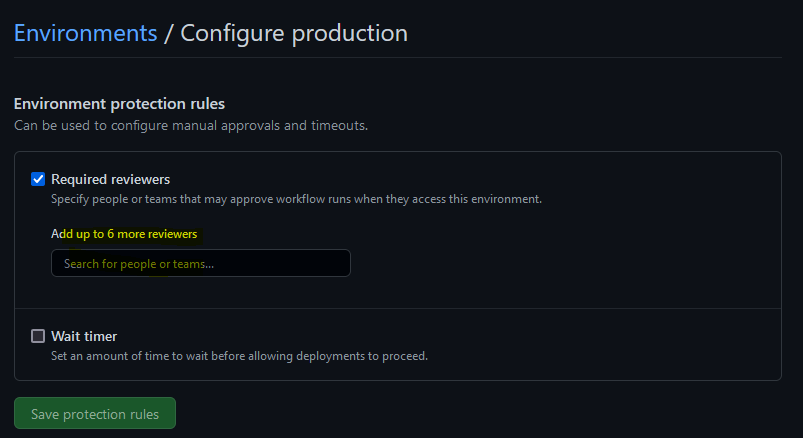
## Configurar secretos por ambiente

#### Nota: Los nombres de los secretos a mostrar son los valores default, se recomienda que permanezcan así. Pero en caso de ser necesario agregarles un sufijo o utilizar otro nombrado al [inicializar el proyecto](#inicializar-proyecto) se deberán especificar.

Una vez creados los ambientes:


Seleccionaremos el ambiente *develop*, y en la parte inferior daremos clic en "add secret":
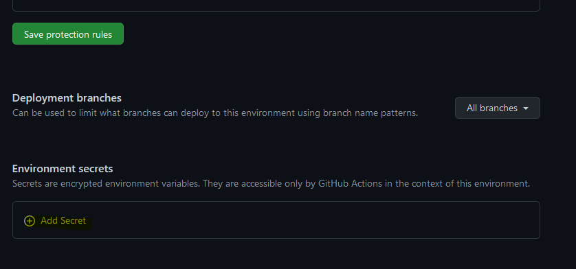

Y conforme a las llaves de acceso [obtenidas en la configuración de llaves ](#configuración-de-llaves-aws) de cada usuario, las agregaremos a los secretos junto con su respectivo número de cuenta de la siguiente manera:

Número de cuenta AWS del ambiente *develop*:

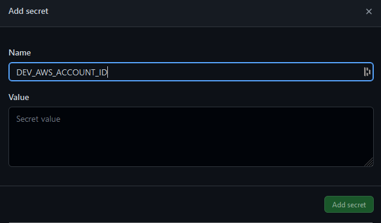

Llave de acceso de usuario para despliegue en ambiente *develop*:

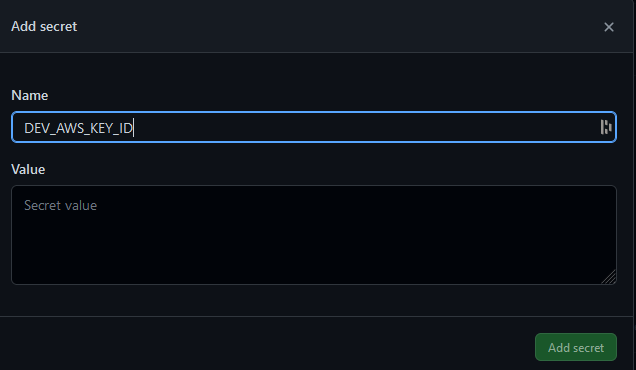

Llave secreta para usuario de despliegue ambiente *develop*:

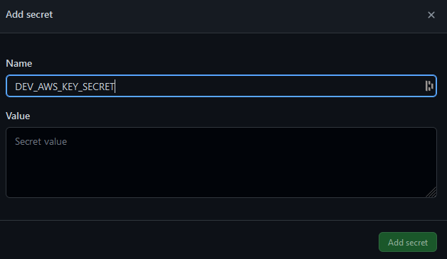

Acto seguido procederemos a dirigirnos al ambiente *production*:


Y comenzaremos a agregar los secretos de este ambiente.

Número de cuenta AWS del ambiente *production*:

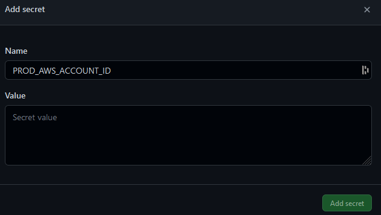

Llave de acceso de usuario para despliegue en ambiente *production*:

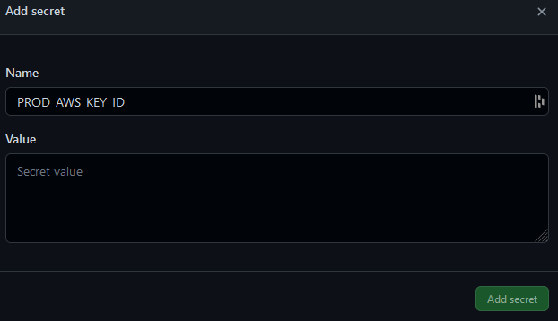

Llave secreta para usuario de despliegue ambiente *production*:

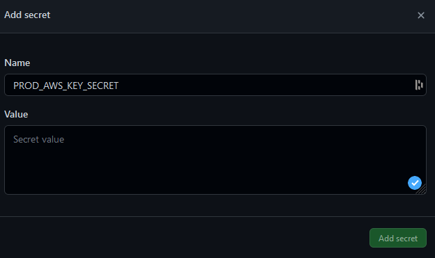


## Inicializar proyecto
Una vez concluidos los pasos anteriores podemos proseguir a inicializar el proyecto, nos moveremos hacia la carpeta donde se alojará el repositorio y ejecutaremos el siguiente comando:

```
cookiecutter https://github.com/rortega-sps/aws_sam_github_quickstart_template
```
Ingresaremos los valores que nos pide la plantilla.
Algunas opciones cuentan con valores default.

A continuación se describen cada una de las opciones:

### *nombre_repo*: Nombre del repositorio de GitHub.

### *org_or_user_github*: Usuario de GitHub u Organización a la que pertenece el repositorio.

### *cfn_stack*: Nombre del stack en AWS. 
Es importante que no incluya el identificador o sufijo del proyecto.

### *project*: Identificador del proyecto. 
Pueden ser las iniciales de la empresa o nombre del proyecto. Se utilizará como sufijo para los recursos del proyecto.

### *DEV_ARN_SSM_KMS*: Llave multiregion para Parameter Store. DEV 
Es una de las llaves que creamos para la región principal en [Creación de llaves KMS](#creación-de-llaves-kms) para el ambiente de Desarrollo.

### *DEV_ARN_DYNAMODB_KMS*: Llave multiregion para DynamoDB. DEV
Es una de las llaves que creamos para la región principal en [Creación de llaves KMS](#creación-de-llaves-kms) para el ambiente de Desarrollo.

### *DEV_ARN_SSM_KMS_DR*: Llave multiregion para Parameter Store. DR. DEV
Es una de las llaves que creamos para la región DR en [Creación de llaves KMS](#creación-de-llaves-kms) para el ambiente de Desarrollo.

### *DEV_ARN_DYNAMODB_KMS_DR*: Llave multiregion para DynamoDB. DR. DEV
Es una de las llaves que creamos para la región DR en [Creación de llaves KMS](#creación-de-llaves-kms) para el ambiente de Desarrollo.

### *PROD_ARN_SSM_KMS*: Llave multiregion para Parameter Store. PROD
Es una de las llaves que creamos para la región principal en [Creación de llaves KMS](#creación-de-llaves-kms) para el ambiente de Producción.

### *PROD_ARN_DYNAMODB_KMS*: Llave multiregion para DynamoDB. PROD
Es una de las llaves que creamos para la región principal en [Creación de llaves KMS](#creación-de-llaves-kms) para el ambiente de Producción.

### *PROD_ARN_SSM_KMS_DR*: Llave multiregion para Parameter Store. DR. PROD
Es una de las llaves que creamos para la región DR en [Creación de llaves KMS](#creación-de-llaves-kms) para el ambiente de Producción.

### *PROD_ARN_DYNAMODB_KMS_DR*: Llave multiregion para DynamoDB. DR. PROD
Es una de las llaves que creamos para la región DR en [Creación de llaves KMS](#creación-de-llaves-kms) para el ambiente de Producción.

### *sam_container*: public.ecr.aws/sam/build-python3.8:1.32.0. 
Es el contenedor que construye la aplicación, en esta caso está como default uno de Python. Pero de ser requerido usar una lambda de otro lenguaje se puede especificar en esta opción.

### *sam_bucket*: Nombre del bucket para SAM. 
Es el bucket que necesita SAM para realizar los despliegues.

### *DEV_secret_aws_key_id*: DEV_AWS_KEY_ID. 
Aquí se deja por default este valor, salvo se haya especificado uno diferente en la [configuración de secretos por ambiente](#configurar-secretos-por-ambiente)

### *DEV_secret_aws_key_secret*: DEV_AWS_KEY_SECRET. 
Aquí se deja por default este valor, salvo se haya especificado uno diferente en la [configuración de secretos por ambiente](#configurar-secretos-por-ambiente)

### *DEV_secret_aws_account_id*: DEV_AWS_ACCOUNT_ID. 
Aquí se deja por default este valor, salvo se haya especificado uno diferente en la [configuración de secretos por ambiente](#configurar-secretos-por-ambiente)

### *PROD_secret_aws_key_id*: PROD_AWS_KEY_ID. 
Aquí se deja por default este valor, salvo se haya especificado uno diferente en la [configuración de secretos por ambiente](#configurar-secretos-por-ambiente)

### *PROD_secret_aws_key_secret*: PROD_AWS_KEY_SECRET. 
Aquí se deja por default este valor, salvo se haya especificado uno diferente en la [configuración de secretos por ambiente](#configurar-secretos-por-ambiente)

#### *PROD_secret_aws_account_id*: PROD_AWS_ACCOUNT_ID. 
Aquí se deja por default este valor, salvo se haya especificado uno diferente en la [configuración de secretos por ambiente](#configurar-secretos-por-ambiente)


## Post inicialización del proyecto
Al terminar de generar el proyecto, por medio de un script se vincula el repo generado con el [repo remoto que creamos en GitHub](#creación-de-repositorio). Por lo tanto ya es posible comenzar a trabajar en él. Pero antes, se recomienda agregar alguna modificación en el archivo template.yaml para desplegar el proyecto Hello world por primera vez y evitar que se tengan problemas relacionados con un primer despliegue fallido.

## Contribuciones

Lista de deseos:
- código: Agregar soporte para poetry o pdm
- ci/cd: Agregar soporte para utilizar OIDC en los workflows
- docs: crear especificación de OpenAPI
- código: Agregar soporte para scopes en API Gateway
- código: Agregar reintentos al consumir el API de RapidAPI
- código: Agrgar replicación de parametros
- código: implementar request-id para mejor trazabilidad
- docs: agregar ejemplos de consultas con logs insights (trace-id, lambda request-id, filtrar por tipo de petición, filtrar por código http)
- código: Agregar filtros al listar animales
- feature: validar uso de configmanager como alternativa a solo usar parameterstore
- docs: cambiar diagrama de api para leerlo de izquierda a derecha
