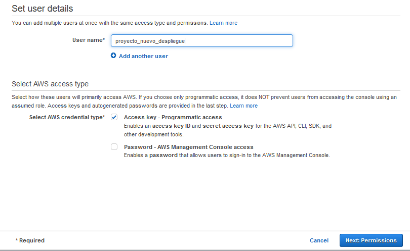
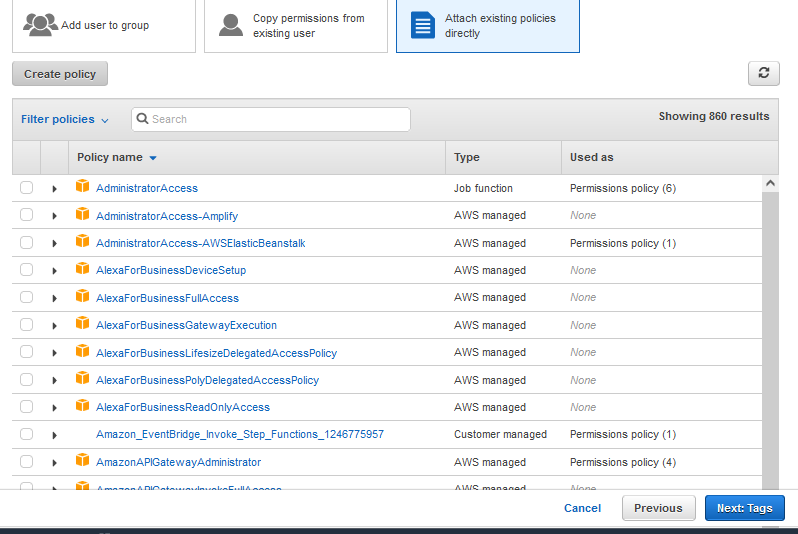
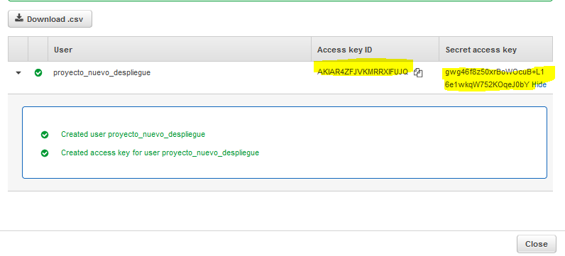

# Cookiecutter Github SAM API

**Diagrama:**

DIAGRAMA DE API EJEMPLO

**Descripción:** Este proyecto es una plantilla que permite generar un proyecto "serverless" básico, que sirva como punto inicial a proyectos pequeños de un solo repositorio.

Si requieres crear un proyecto más complejo (multiples repositorios y/o más de 3 desarrolladores) o tú proyecto ya tiene demasidadas lambdas contacta al equipo de CI/CD. 

**Tipo:** API

**[Recuperación de desastres](https://aws.amazon.com/blogs/architecture/disaster-recovery-dr-architecture-on-aws-part-iii-pilot-light-and-warm-standby/)**:
- Categoría: Activo/Pasivo (Active/pasive)
- Estrategia: Espera caliente (Warm standby) 

**Lenguaje:** [Python 3.9](https://www.python.org/downloads/release/python-3913/)

**Dependencias:**
- [AWS Lambda Powertools 1.28](https://awslabs.github.io/aws-lambda-powertools-python/1.28.0/)

**Servicios:**
- [AWS API Gateway (HTTP)](https://docs.aws.amazon.com/apigateway/latest/developerguide/http-api.html)
- [AWS Lambda](https://docs.aws.amazon.com/es_es/lambda/latest/dg/welcome.html)
- [AWS DynamoDB](https://docs.aws.amazon.com/dynamodb/?icmpid=docs_homepage_featuredsvcs)
- [AWS Parameter Store](https://docs.aws.amazon.com/systems-manager/latest/userguide/systems-manager-parameter-store.html)
- [AWS CloudFormation](https://docs.aws.amazon.com/AWSCloudFormation/latest/UserGuide/Welcome.html)

**Herramientas:**
- [Cookiecutter 2.1.1](https://cookiecutter.readthedocs.io/en/2.1.1/)
- [AWS SAM ](https://docs.aws.amazon.com/serverless-application-model/latest/developerguide/serverless-sam-cli-install.html)
- [Git](https://git-scm.com/book/en/v2/Getting-Started-Installing-Git)

**Crear proyecto:** [Cookiecutter](#cookiecutter)

------------------------------------------------------------------------------------------------------------

## AWS y Serverless
AWS tiene varios servicios administrados que se cobran por uso, los más comunes: colas de mensajes, bus de eventos, administración de APIs, orquestación de servicios y envío de notificaciones. No es necesario instalar un producto en un servidor y mantenerlo actualizado, AWS se encarga de estas tareas y así nos concentramos en elegir la mejor herramienta para nuestro caso de uso.

También permite ejecutar código sin necesidad de un servidor dedicado: al recibir un evento que cumple ciertas condiciones AWS crea una instancia que ejecuta nuestro código, según la demanda puede crear más instancias. El cobro es por el tiempo que duró la ejecución del código y el número de instancias creadas. 

Se pueden diseñar soluciones completas utilizando estas herramientas y a este tipo de aplicaciones se les conoce como "serverless" (sin servidor). 

https://aws.amazon.com/serverless/

## CloudFormation
Es posible habilitar y configurar todos estos servicios de distintas maneras:
- [Consola web](https://console.aws.amazon.com)
- [CLI](https://aws.amazon.com/cli/)
- [APIs](https://docs.aws.amazon.com/)
- [SDKs](https://aws.amazon.com/developer/tools/)

Todas son útiles en distintos escenarios pero AWS ha creado otro servicio que permite tener estas definiciones en archivos de texto (YAML o JSON) que pueden ser agregados a un repositorio de código como este y utilizarlo para crear y modificar recursos en AWS. De esta manera se puede tener una trazabilidad sobre los cambios que se han realizado en un sistema, colaborar y realizar modificaciones modificando esta definición (infraestructura como código).

IMAGEN PARA ILUSTRAR CLOUDFORMATION

_¿Cómo funciona CloudFormation?: https://docs.aws.amazon.com/AWSCloudFormation/latest/UserGuide/cfn-whatis-howdoesitwork.html_


### SAM

Las plantillas de CloudFormation pueden crecer rápidamente y definir todos los recursos de una aplicación puede ser una tarea repetitiva y tardada, para solucionar esto AWS ha creado un framework que permite definir la mayoría de recursos de una aplicación "serverless" de una forma simple y con menos líneas. 

DIAGRAMA MOSTRANDO SAM Y CLOUDFORMATION

Estas definiciones cortas soportan la mayoría de servicios utilizados en una aplicación "serverless" como:

-   [AWS::Serverless::Api](https://docs.aws.amazon.com/serverless-application-model/latest/developerguide/sam-resource-api.html)
Crea una función lambda que recibe peticiones a traves del API Gateway, permite agregar un documento de OpenAPI para la configuración del API REST. [Comparación entre API REST y HTTP API](https://docs.aws.amazon.com/apigateway/latest/developerguide/http-api-vs-rest.html)

-   [AWS::Serverless::Function](https://docs.aws.amazon.com/serverless-application-model/latest/developerguide/sam-resource-function.html)
Crea una función lambda y un rol de IAM asociado a ella. La función puede ser iniciada por distintos eventos (S3 | SNS | Kinesis | DynamoDB | SQS | Api | Schedule | CloudWatchEvent | EventBridgeRule | CloudWatchLogs | IoTRule | AlexaSkill)

-   [AWS::Serverless::HttpApi](https://docs.aws.amazon.com/serverless-application-model/latest/developerguide/sam-resource-httpapi.html)
Crea una función lambda que recibe peticiones a traves del API Gateway. [Comparación entre API REST y HTTP API](https://docs.aws.amazon.com/apigateway/latest/developerguide/http-api-vs-rest.html)

-   [AWS::Serverless::LayerVersion](https://docs.aws.amazon.com/serverless-application-model/latest/developerguide/sam-resource-layerversion.html)
Si multiples funciones requieren las mismas librerías es posible crear una capa reutilizables que incluya estas librerías.

-   [AWS::Serverless::SimpleTable](https://docs.aws.amazon.com/serverless-application-model/latest/developerguide/sam-resource-simpletable.html)
Permite crear tablas de DynamoDB.

-   [AWS::Serverless::StateMachine](https://docs.aws.amazon.com/serverless-application-model/latest/developerguide/sam-resource-statemachine.html)
SAM también tiene soporte para agregar a tu proyecto Step Functions y orquestar distintas lambdas o incluso otros servicios de AWS.

### Cursos

Si quieres aprender a crear aplicaciones con herramientas "serverless" de AWS puedes tomar alguno de estos cursos (en negritas están los recomendados):
- [**Coursera: Building Modern Python Applications on AWS**](https://www.coursera.org/learn/building-modern-python-applications-on-aws?specialization=aws-python-serverless-development)
  - Este curso da una introducción a los servicios más usados al construir aplicaciones serverless (Lambda, API Gateway, DynamoDB, Cognito y S3), a las herramientas que estaras utilizando en el día a día (AWS CLI, Boto3 Cloud Shell y Postman) y a utilizar una metodología orientada a APIs (API Driven Development). Es el curso que se recomienda tomar antes de iniciar tu primer proyecto. El curso se puede tomar de forma gratuita, pero para realizar las prácticas, cuestionarios y obtener un certificado de completado se debe realizar un pago.
  - Existen versiones del curso para otros lenguajes: [Building Modern Java Applications on AWS](https://www.coursera.org/learn/building-modern-java-applications-on-aws?specialization=aws-java-serverless-development) y [Building Modern Node.js Applications on AWS](https://www.coursera.org/learn/building-modern-node-applications-on-aws?specialization=aws-nodejs-serverless-development)
- [**AWS Workshop: Building Serverless Apps with SAM**](https://catalog.us-east-1.prod.workshops.aws/workshops/d21ec850-bab5-4276-af98-a91664f8b161)
  - Es una introducción rápida al framework de SAM, si tienes prisa con este workshop aprenderas lo  minimo necesaro para construir aplicaciones con SAM.
- [Serverless land: Learn](https://serverlessland.com/learn)
  - Serverless land es un sitio creado y mantenido por el equipo de AWS, en la sección de _learn_ hay algunos cursos si se quiere profundizar más en el uso de estas herramientas.
- [Coursera: AWS Fundamentals Building Serverless Applications](https://www.coursera.org/learn/aws-fundamentals-building-serverless-applications#syllabus)
  - Construye un chatbot utilizando herramientas serverless. El curso se puede tomar de forma gratuita, pero para realizar las prácticas, cuestionarios y obtener un certificado de completado se debe realizar un pago.

### AWS IDE Toolkits

AWS ofrece extensiones para distintos IDEs, los relevantes para este repositorio son:
- [Visual Studio Code](https://aws.amazon.com/visualstudiocode/)
- [PyCharm](https://aws.amazon.com/pycharm/)

Utilizar alguna de estas extensiones en tu IDE favorito te facilitará el desarrollo de aplicaciones SAM.

### Referencias

Estas referencias pueden ser útiles cuando estás desarrollando una aplicación con SAM:

- [Lista de recursos que agrega SAM a CLoudFormation (Más simples describir)](https://docs.aws.amazon.com/serverless-application-model/latest/developerguide/sam-specification-resources-and-properties.html)
- [Lista de recursos en CloudFormation](https://docs.aws.amazon.com/AWSCloudFormation/latest/UserGuide/aws-template-resource-type-ref.html)
- [Lista de política incluidas en SAM](https://docs.aws.amazon.com/serverless-application-model/latest/developerguide/serverless-policy-templates.html)
- [Patrónes comunes al usar SAM y herramientas "serverless"](https://serverlessland.com/patterns?framework=SAM)
- [Ejemplos de máquinas de estados (Step Functions)](https://serverlessland.com/workflows)
- [Fragmentos de código y consultas comunes](https://serverlessland.com/snippets)


## Github y Github Actions (Breve explicación con ligas a tutoriales y documentación de Github)


### Ramas (Explicación de trunk based development)

### Referencias

### Github Workflows (Como los workflows en el repo permiten seguir la estrategia de ramas y desplegar con algunos clics)


Workflow reusables (Como los workflows hacen llamados a los workflows reusables para completar tareas y liga a la administración de workflows)

Agregar nota: Si el proyecto crece y se crean multiples repositorios, se debe crear un repo independiente en el que puedan guardarse los workflows reusables y otras utilerías

### Referencias

## Cookiecutter

Crea un proyecto (Crear proyecto a partir de plantilla de cookiecutter y agregar las credenciales como secretos en Github)
## Prerequisitos:
Contar con las siguientes herramientas instaladas:
   - [Python](https://www.python.org/downloads/release/python-3913/)
   - [Cookiecutter](https://cookiecutter.readthedocs.io/en/stable/installation.html)
   - [Git](https://git-scm.com/downloads)
   - 
## Overview:

```mermaid
  graph TD;

      1_GitHub-->crear_repositorio;
      crear_repositorio-->crear_ambientes;
      crear_ambientes-->configurar_secretos_ambiente;
      copiar_access_key-->agregar_secreto_de_access_key;
      copiar_secret_key-->agregar_secreto_de_secret_key;
      configurar_secretos_ambiente-->agregar_secreto_de_access_key;
      configurar_secretos_ambiente-->agregar_secreto_de_secret_key;
      configurar_secretos_ambiente-->agregar_account_id;
        
      AWS-->2_IAM;
      2_IAM-->crear_usuario;
      crear_usuario-->marcar_acceso_programatico;
      marcar_acceso_programatico-->agregar_politicas_requeridas;
      agregar_politicas_requeridas-->agregar_tags_del_proyecto;
      agregar_tags_del_proyecto-->copiar_access_key;
      agregar_tags_del_proyecto-->copiar_secret_key;
      

      AWS-->3_KMS;
      3_KMS-->crear_llave_simetrica_multiregion_SSM;
      crear_llave_simetrica_multiregion_SSM-->copiar_ARN;
      3_KMS-->crear_llave_simetrica_multiregion_DynamoDB;
      crear_llave_simetrica_multiregion_DynamoDB-->copiar_ARN;
      crear_llave_simetrica_multiregion_SSM-->configurar_regionalidad_en_region_dr;
      crear_llave_simetrica_multiregion_DynamoDB-->configurar_regionalidad_en_region_dr;
      configurar_regionalidad_en_region_dr-->copiar_ARN;
      copiar_ARN-->ingresarlos_al_inicializar_cookiecutter;      
```
#### - Los pasos 1 y 2 deberán ser realizados en las cuentas AWS de cada ambiente (develop, prod)
## Pasos

---
[1. Creación de repositorio](#creación-de-repositorio) \
[2. Creación de llaves KMS](#creación-de-llaves-kms) \
[3. Configuración de llaves AWS](#configuración-de-llaves-aws) \

---

## Creación de repositorio
-------------------
Se debe crear un repositorio nuevo. El repositorio debe ser creado vacío, para que se pueda inicializar correctamente el proyecto.

## Creación de llaves KMS
-------------------
Como prerequisito es importante crear 2 llaves KMS "[multiregión](https://docs.aws.amazon.com/kms/latest/developerguide/multi-region-keys-overview.html)", una para SSM y otra para DynamoDB.
La región de creación de la llave será la región principal. Y la secundaría será la destinada para DR.

El nombrado debe seguir el siguiente estándar:
identificador_del_proyecto-servicio_de_aws-ambiente

Ejemplo de llave SSM:

Identificador = proyectonuevo\
Servicio = ssm\
Ambiente = dev

#### Nombre de la nueva llave a crear: proyectonuevo-ssm-dev
Ejemplo de llave DynamoDB:

Identificador = proyectonuevo\
Servicio = dynamo\
Ambiente = dev

#### Nombre de la nueva llave a crear: proyectonuevo-dynamodb-dev

NOTA: Cuando iniciemos la creación de nuestra plantilla quickstart Cookiecutter nos solicitará los ARN's 
de ambas llaves. Por lo que es importante tenerlas a la mano cuando se inicialice el proyecto.

## Configuración de llaves AWS
-------------------
Para poder realizar los despliegues a una cuenta AWS. Es importante generar un usuario en las cuentas
destino para que esto se pueda lograr. Es muy importante que el usuario cuente con acceso programático. 
Para mayor información visitar: https://docs.aws.amazon.com/IAM/latest/UserGuide/id_users_create.html#id_users_create_console


### Creando usuario:
#### Crear usuario con acceso programático:


#### Agregar las políticas necesarias:
En este punto es indispensable que el usuario que desplegará, cuente con acceso a Cloudformation y los servicios que estará
desplegando:


#### Agregar tag relacionado al proyecto:

#### Se salvaguardarán las credenciales generadas:
Estas serán configuradas en los secretos de GitHub, al igual que el número de cuenta de AWS.


## Inicializar proyecto
Una vez concluidos los pasos anteriores podemos proseguir a inicializar el proyecto, nos moveremos hacia la carpeta donde se alojará el repositorio y ejecutaremos el siguiente comando:

```
cookiecutter https://github.com/rortega-sps/aws_sam_github_quickstart_template
```
